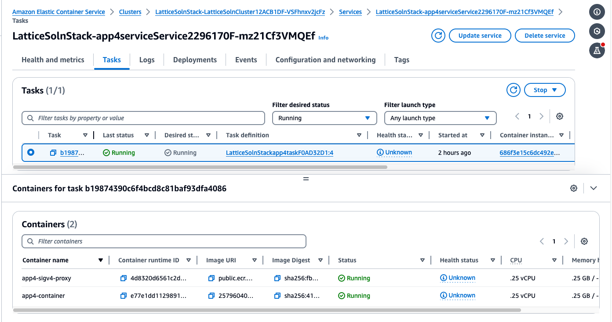

# Modern web application authentication and authorization with Amazon VPC Lattice

This repository accompanies the blog post https://aws.amazon.com/blogs/security/modern-web-application-authentication-and-authorization-with-amazon-vpc-lattice/

It will deploy the following components:

* A VPC with associated subnets, NAT Gateways and Internet Gateway. Internet access is required so the solution is able to retrieve JWKS details from your OAuth Provider.
* Route53 hosted zone for handling traffic routing to the configured domain and VPC Lattice services.
* ECS Cluster (default 2 container hosts) to run the ECS tasks
* 4 Application Load Balancers, one for front-end envoy routing and one for each application component. 
    * All application load balancers are internally facing.
    * Application component load balancers are configured to only accept traffic from the VPC Lattice Managed Prefix List.
    * The front-end envoy load balancer is configured to accept traffic from any host 
* 3 VPC Lattice Services and 1 VPC Lattice Network.
* AWS Private CA and 1-4 Private certificates issued using ACM

The repository demonstrates some novel and reusable solution components:

* JWT Authorization and translation of scopes to headers, integrating an external IdP into our solution for user authentication.
* SigV4 signing from an Envoy Proxy running in a container.
* Service to service flows, using SigV4 signing in node.js and container based credentials.
* Integration of VPC Lattice with ECS containers, using CDK

Note: This solution is intended as sample code only, and not for production use. In particular, it does not implement TLS to the container and the sample application will echo the contents of the request back to the caller.

## Walkthrough

### Prerequisites

Before you begin, you must have the following prerequisites in place:

* An AWS account to deploy solution resources into. AWS credentials should be available to the AWS CDK in the environment or configuration files for the CDK deploy to function.
* Python 3.9.6 or higher
* Docker or Finch for building containers. If using Finch, ensure the Finch executable is in your path and instruct the CDK to use it with the command export CDK_DOCKER=finch
* Enable elastic network interface (ENI) trunking in your account to allow more containers to run in VPC networking mode:

```bash
aws ecs put-account-setting-default \
      --name awsvpcTrunking \
      --value enabled
```

### Deploy without OAuth functionality

1. Create and Initialize a python virtual environment

```bash
# Create a new venv
python -m venv .venv

# Activate the virtual environment
source .venv/bin/activate
```

2. Deploy the solution

```bash
# For example app.internal
cdk deploy -c app_domain=<application domain>
```

3. Test the solution

Grab the Application LoadBalancer url of the envoy frontend proxy from the [ELB console](https://console.aws.amazon.com/ec2/home?#LoadBalancers:search=envoy;).

App4 uses sigv4 proxy for IAM authentication to talk to other services in the VPC Lattice service network.



```bash
export FRONTEND_URL=<Your ALB URL from the ELB console>
curl -v -insecure https://$FRONTEND_URL/app4/hello
```

Call App1 from App4 - it succeeds as VPC Lattice auth policy allows this communication
```bash
curl -v -insecure https://$FRONTEND_URL/app4/call-to-app1
```

```output
....
"x-amzn-lattice-identity": "Principal=arn:aws:sts::123456789012:assumed-role/LatticeSolnStack-EnvoyFrontendTaskRoleA297DB4D-8MekcPzc6FSg/503e18cee581465f914c75291291e98e; PrincipalOrgID=o-12345678; SessionName=503e18cee581465f914c75291291e98e; Type=AWS_IAM",
    "x-amzn-lattice-network": "SourceVpcArn=arn:aws:ec2:us-east-1:123456789012:vpc/vpc-123456789",
    "x-amzn-lattice-target": "ServiceArn=arn:aws:vpc-lattice:us-east-1:123456789012:service/svc-0725375ee8851076b; ServiceNetworkArn=arn:aws:vpc-lattice:us-east-1:123456789012:servicenetwork/sn-0827fa025cfa385f2; TargetGroupArn=arn:aws:vpc-lattice:us-east-1:123456789012:targetgroup/tg-02dd764d44bb49a8c",
    "x-amzn-source-vpc": "vpc-123456789"
  }
* Connection #0 to host Lattic-envoy-1234567890-551479862.us-east-1.elb.amazonaws.com left intact
}
...
```

Call App3 from App4 - it fails with AccessDenied Exception due to explicit deny in VPC Lattice Auth Policy
```bash
curl -v -insecure https://$FRONTEND_URL/app4/call-to-app3
```

```output
....
AccessDeniedException: User: arn:aws:sts::123456789012:assumed-role/LatticeSolnStack-app4TaskRole385CC124-4Y8TAT90XIR6/b19874390c6f4bcd8c81baf93dfa4086 is not authorized to perform: vpc-lattice-svcs:Invoke on resource: arn:aws:vpc-lattice:us-east-1:123456789012:service/svc-0b99930a48161a203/ with an explicit deny in a service-based policy
...
```